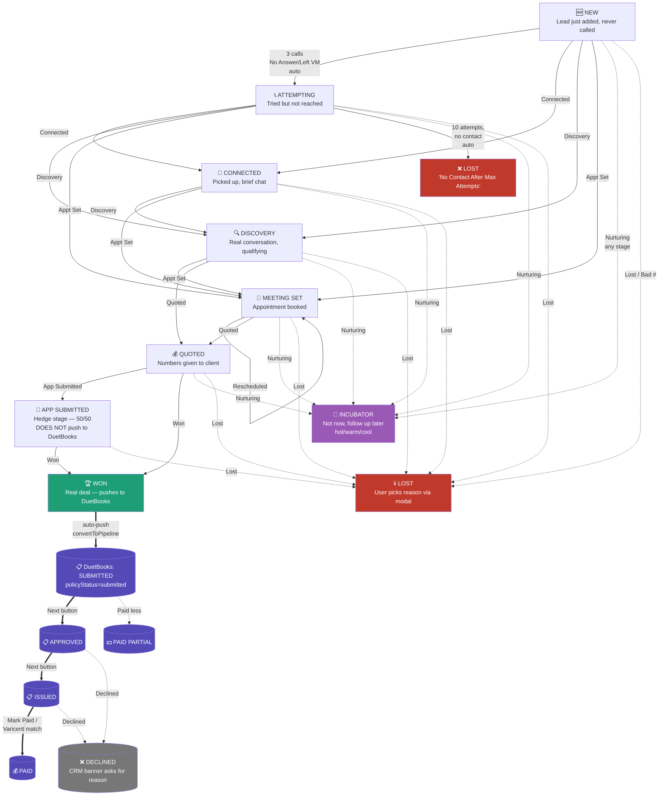
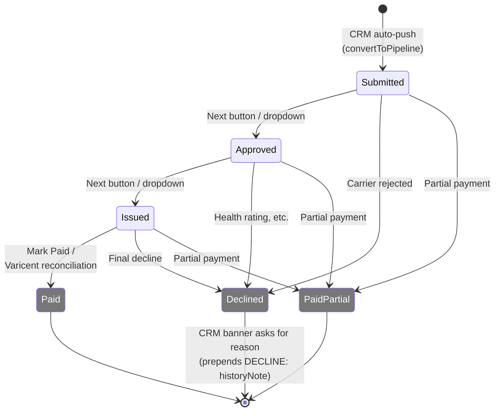

# DuetCRM — Stage Flow Mind Map

> Visual reference for how leads move through CRM stages and into the DuetBooks policy lifecycle.
> Render the Mermaid diagram in any markdown viewer (GitHub, Notion, VS Code preview, etc.) or copy to https://mermaid.live for an interactive view.

---

## Full flowchart



---

## The 5 Phases

| # | Phase | Stages | What's happening |
|---|---|---|---|
| 1 | **Hunting** | `new` → `attempting` | Calling, leaving voicemails, building call count |
| 2 | **Engaging** | `connected` → `discovery` | Got them on the phone, learning needs |
| 3 | **Committing** | `meeting_set` → `quoted` | Scheduled, numbers presented |
| 4 | **Closing** | `app_submitted` → `won` | Paperwork in flight → deal closed |
| 5 | **Policy** | DuetBooks: `submitted` → `approved` → `issued` → `paid` | Underwriting + payment lifecycle (DuetBooks owns) |

---

## Transition triggers

| From | To | Trigger | Auto/Manual |
|---|---|---|---|
| `new` | `attempting` | 3+ calls logged with No Answer / Left VM | 🤖 **AUTO** (logCall + Calley sync) |
| `new`/`attempting` | `connected` | Disposition = "Connected" | 👆 Manual |
| `new`/`attempting`/`connected` | `discovery` | Disposition = "Discovery" | 👆 Manual |
| any active | `meeting_set` | Disposition = "Appt Set" | 👆 Manual |
| `discovery`/`meeting_set`/`quoted` | `quoted` | Disposition = "Quoted" / manual stage | 👆 Manual |
| `quoted`/`meeting_set` | `app_submitted` | Disposition = "App Submitted" | 👆 Manual — **NOT pushed to DuetBooks** |
| `quoted`/`app_submitted` | `won` | Disposition = "Won" / manual stage | 👆 Manual — **AUTO-pushes to DuetBooks at status=submitted** |
| `attempting` | `lost` (auto) | 10+ attempts, no contact ever | 🤖 **AUTO** — reason "No Contact After Max Attempts" |
| any | `lost` (user) | Click "📉 Mark Lost" button | 👆 Modal — required reason + optional 150-char notes |
| any | `lost` (Calley) | Calley feedback "Lost" or "Bad #" | 🤖 **AUTO** — defaults "Not Interested" / "Bad Number" |
| any | `incubator` | Disposition = "Nurturing" | 👆 Manual — temp=warm by default |

---

## Terminal states (lead is no longer "active")

- **`won`** — drives the DuetBooks policy lifecycle. Two-status model: opportunity stays Won forever, policy cycles through underwriting.
- **`lost`** — reason captured (from modal or auto-default).
- **`incubator`** — parked. Comes back when callback date hits.

---

## Critical architecture rule

> **Only `won` auto-pushes to DuetBooks.** `app_submitted` is deliberately CRM-only — used when you've sent the app but think it's 50/50. Don't clutter DuetBooks with speculative records.

This is why both the CRM Cleanup tool and the DuetBooks pending banner filter on `stage === 'won'` only.

---

## DuetBooks-side flow (after Won)



Every status change in DuetBooks **pushes back to the matching CRM lead** via `PATCH /leads/data/<idx>/policyStatus` if the case has `crmLeadId`. This is what makes the Policy badge in the CRM lead detail stay in sync.

---

## Quick decision guide for the rep

```
Did they pick up?
├── No  → Pick: No Answer / Left VM / Bad #
│         └── 3rd call → AUTO-promotes to Attempting
│         └── 10th call with no contact → AUTO-marks Lost
├── Yes, briefly → "Connected" → stage moves to Connected
├── Yes, real talk → "Discovery" → stage moves to Discovery
├── Yes, booked → "Appt Set" → stage moves to Meeting Set + Quick Book opens
├── Yes, gave quote → "Quoted" → stage moves to Quoted
├── Yes, sent app (might fail) → "App Submitted" → stays in CRM, not DuetBooks
├── Yes, closed → "Won" → AUTO-pushes to DuetBooks at submitted
├── Yes, no thanks → "📉 Mark Lost" → modal asks reason + notes
└── Yes, not now → "Nurturing" → parks in Incubator (set callback date)
```

---

*Generated 2026-05-22 — pairs with [Duet_Project_Map.md](./Duet_Project_Map.md) and [SESSION_HANDOFF.md](./SESSION_HANDOFF.md).*
